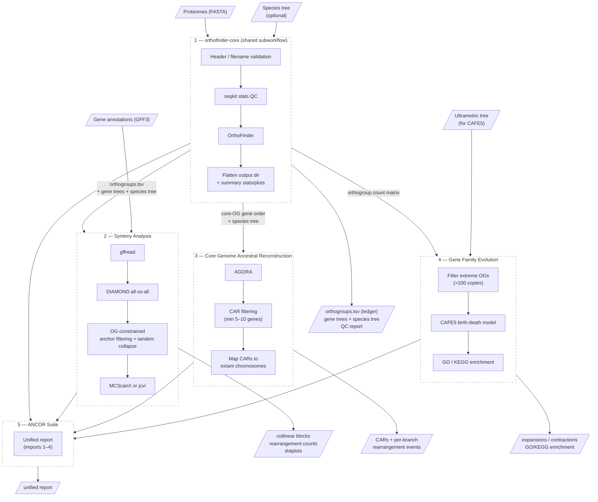

# ANCOR — Reference Doc

*Companion to `comparative-genomics-program.md` (§1, §6, §7, §9). Consolidates the three ANCOR design documents into one reference for readers unfamiliar with the effort.*

Status: design stage (no Galaxy implementation yet), 2026-07-30

## What it is

**ANCOR — Analysis of Networked Core Orthologs for Reconstruction.** A comparative-genomics workflow suite for eukaryotic pathogen genomes, where gene duplication, structural rearrangement, and subtelomeric variability break naive approaches. Core principle: **anchor structural inference on core (single/low-copy) orthogroups; analyze multi-copy family dynamics separately.** Derived from the Escalante lab's *P. coatneyi* / *P. gonderi* methodology, generalized and Galaxy-ified. The hope is that ANCOR can partly cover crypto protocol Module 3 (also Escalante lab origin) — the orthology, synteny, ancestry, and gene-family layers — as a generalized, reusable Galaxy suite.

## Scope

- **Organisms**: eukaryotic pathogens (apicomplexans, kinetoplastids, fungi) — any clade with multiple decent assemblies; paralogy-rich/subtelomeric genomes are the target, not a restriction.
- **Inputs**: genome assemblies (FASTA), gene annotations (GFF3), protein sequences (FASTA).
- **Not in scope (v1)**: raw reads, assembly, annotation (an optional "harmonize first" entry point via PANTEON's Liftoff/TOGA2 layer is planned — see program doc §4.2). **No HyPhy/selection analysis** — that is CAPHEINE's exclusively (program doc §1, §3).
- **Timescale**: cross-species (deep divergence).

## Design principles

1. **Core genome drives structure** — only single/low-copy orthogroups used for synteny and ancestry.
2. **Gene families analyzed separately** — multi-copy orthogroups retained for expansion/contraction modeling.
3. **Local, not global, conservation** — local synteny assumed; rearrangements expected and allowed.
4. **Constrained ancestry** — ancestral reconstruction reflects the core-genome backbone only; output interpreted as backbone, not whole-genome ground truth.

## Suite architecture

Publishing pattern: **Option B modular** — four importable workflows + one convenience suite, per IWC best practice. `orthofinder-core` is the shared foundation; workflows 2–4 each consume its outputs:

1. **`orthofinder-core`** (shared subworkflow) — the entry point for all other ANCOR workflows. Inputs: proteome collection (+ optional user species tree). Steps: header/filename validation → `seqkit stats` QC → **OrthoFinder** → flatten timestamped output dir → summary stats/plots. Outputs: `orthogroups.tsv` (orthology ledger format, program doc §4.1), `orthogroups_counts.tsv` (CAFE5 input), single-copy OG sequences, per-OG gene trees, species tree, QC report.
2. **Synteny Analysis** — consumes orthogroups + gene positions from `orthofinder-core`. gffread gene positions → DIAMOND all-vs-all → orthogroup-constrained anchor filtering → tandem collapse (≤10 genes window) → core-OG filter (≤2 copies/species default) → **MCScanX** (or **jcvi** MCScan) → collinear blocks, dotplots, rearrangement counts (fusions/fissions, translocations, inversions).
3. **Core Genome Ancestral Reconstruction** — consumes core-OG gene-order files + species tree from `orthofinder-core`. **AGORA** → CAR filtering (min ~5–10 genes / ≥50 in one design — reconcile) → map CARs to extant chromosomes → per-branch rearrangement events. Enforcement: reconstruct only at nodes with ≥3 descending lineages meeting contiguity gates.
4. **Gene Family Evolution** — consumes orthogroup count matrix from `orthofinder-core`. Filter extreme OG counts (>100 copies) → **CAFE5** birth-death model on count matrix + **ultrametric** species tree → significant expansions/contractions → GO/KEGG enrichment. Retains multi-copy families (the point of the workflow).
5. **ANCOR Suite** — imports 1–4, unified report.

> Specific workflow names and step descriptions are tentative — actual workflow structure may change as planning continues.

### Workflow diagram

## Tools and availability

| Tool | Role | Bioconda | Galaxy/IUC | Notes |
|---|---|---|---|---|
| OrthoFinder | orthology engine | ✅ | ✅ IUC | no new wrapper needed |
| DIAMOND | similarity search | ✅ | ✅ IUC | |
| seqkit | FASTA/QC stats | ✅ | ✅ | |
| gffread | gene-position extraction | ✅ | ✅ | |
| MCScanX | synteny blocks | ✅ | 🟡 informal ToolShed wrapper; needs IUC-standard wrapper | owned by ANCOR (program doc §6) |
| jcvi | synteny alternative + viz | ✅ | 🟡 fragmented subcommand wrappers | |
| CAFE5 | gene-family birth-death | ✅ (`cafe`) | 🟡 needs IUC wrapper | low effort, simple CLI |
| AGORA | ancestral reconstruction | ✅ | ❌ | needs IUC wrapper — Docker image exists upstream, bioconda available |
| r8s / TreePL / chronos | tree ultrametricization for CAFE5 | — | ❌ | **out of scope v1**: require user-provided ultrametric tree |
| Custom parsers/plotters | output shaping, reports, dotplots/CAR barcodes | — | 📦 | many, small each |

Additional planned shared pieces (program doc §4.2): **`assembly-qc-gate`** (BUSCO ≥85% + contig N50) as intake step 0 — new, small, shared with PANTEON.

## Per-organism parameters

Any organism-specific configuration is supplied as workflow parameters (only what can't be computed from the data):

| Parameter | Used by | Notes |
|---|---|---|
| Proteome collection (FASTA) | orthofinder-core | required input |
| Gene annotations (GFF3) | synteny analysis | required for gene positions |
| Species tree (optional) | orthofinder-core | if user wants to override OrthoFinder's STAG tree |
| Ultrametric tree | gene family evolution | required for CAFE5; user-provided in v1 |
| Assembly QC thresholds | assembly-qc-gate | BUSCO lineage + N50 cutoffs |

For the crypto protocol instance specifically: assembly eligibility gates (BUSCO ≥85% wide; N50 ≥500 kb for structural analyses), CAFE5 assembly-confounding sensitivity (family size regressed on contig N50; run on both sets, report concordant only), and IQ-TREE+ASTRAL species tree with gCF/sCF preferred over OrthoFinder's STAG default (open question, program doc §10).

## Open questions (from source docs + program doc §10)

- Species tree: OrthoFinder STAG tree vs external IQ-TREE+ASTRAL (crypto prefers the latter).
- CAFE5 ultrametric tree: user-provided (v1 decision) vs integrated dating step.
- AGORA input preparation: adapt an existing gene-order script?
- Visualization: package paper-style custom plots vs Galaxy-native.
- MVP order: synteny-first (fewest wrapper deps) vs suite-first.
- UCSC assembly hub output: PANTEON produces hubs (WF-K). Should ANCOR also emit a hub (e.g. synteny blocks, CAR reconstructions, gene-family expansion tracks) for visualization on the BRC site?

## Sources

- `ancor-workflow-designs.md` — detailed Plasmodium-specific designs (Escalante-lab replication); coined `orthofinder-core`; tool status legend.
- `ANCOR_workflows.md` — ANCOR-branded framework, scope + design principles.
- `ANCOR_workflows_detailed.md` — ANCOR-branded DAGs + tooling-gap table.
- `ancor-core.ga` — draft core workflow skeleton.
