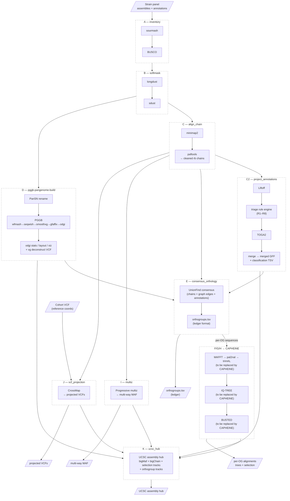

# PANTEON (PANgenome Trees & Evolutionary Orthology Networks) — Reference Doc

*Companion to `comparative-genomics-program.md` (§2.1, §4, §7). Reference for readers unfamiliar with the pangenome work; the only timescale suite with a working prototype (PLAIG and ANCOR are design-only). CAPHEINE is already in IWC but is the shared engine, not a timescale suite.*

Status: delivered — Galaxy wrappers + workflows, proven on the *P. vivax* 8-strain panel (Pv4), 2026-07-30

## What it is

A **within-species pangenome pipeline** for eukaryotic pathogens: builds a PGGB variation graph from a strain panel, projects and reconciles gene annotations, derives consensus orthogroups from three evidence sources, and produces per-orthogroup alignments/trees/selection tests plus UCSC assembly hubs. Developed on *P. vivax* (PvP01, Sal-I, PvW1, PAM, PvSY56, PvT01, PvC01, MHC087); designed to port by config, not code (program doc §7.2).

## Code organization

- **`brc-tools/libs/pangenome-helpers/`** — Python library holding all orchestration logic (manifest, cds, pansn, maf, anchors, overlap, graph_edges, consensus, triage, orthology, merge, hub, selection, phase_c2). Design rule: **Galaxy wrappers stay thin** (argparse + logging); all logic pytest-covered in the library; PyPI/Bioconda distribution planned. Built on `genome-io`.
- **`brc-tools/workflows/`** — gxformat2 (`*.gxwf.yml`) Galaxy workflow definitions, one per phase.
- **`brc-tools/tools/`** — Galaxy tool XML wrappers (`anchor_prep`, `build_genomes_txt`, `build_hub_bb`, `build_trackdb`, ...).

## Workflow inventory (phases A–K)

| WF | Name | What it does | Key tools | IWC status |
|---|---|---|---|---|
| A | `inventory` | Panel QC: sourmash similarity matrix + per-strain BUSCO (lineage configurable, default `apicomplexa_odb10`) | sourmash, BUSCO | IUC-wrapped |
| B | `softmask` | Soft-mask assemblies at union of longdust + sdust low-complexity intervals, index | longdust, sdust | custom wrapper — triage: replace w/ existing Gxy tool or wrap via pangenome-helpers |
| C | `align_chain` | Pairwise alignment → UCSC chains (cleaned + reciprocal-best) | minimap2, paftools | custom wrapper — triage |
| C2 | `project_annotations` | Anchor annotation projection: Liftoff → **triage** (R1–R8 rule engine) → merge with TOGA2; emits classification TSV + merged GFF | Liftoff, TOGA2, `pangenome_helpers.triage/merge` | custom wrapper — triage; **candidate for reuse by other suites** |
| D | `pggb-pangenome-build` | PanSN rename → concat → **PGGB** (wfmash→seqwish→smoothxg→gfaffix→odgi) → odgi stats, layout/viz, optional VCF via vg deconstruct. Defaults: `map_pct_id 90` intra-species (70–80 inter), segment 5 kb. ~3–6 h / 20 GB for 8 × 25 Mb haploid genomes | pggb, odgi, vg | IUC-wrapped |
| E | `consensus_orthology` | **Consensus orthogroups**: UnionFind over three evidence sources — Liftoff/TOGA classifications (C.4), reciprocal-best chain edges (C), PGGB graph-path co-membership edges (D) — labeled CORE-1:1 / CORE-VAR / FAMILY. Emits `ortholog_table.tsv` (≈ program ledger format) | `pangenome_helpers.consensus` | custom wrapper — triage |
| F | `msa` | Per-orthogroup MSAs from the consensus table: MAFFT L-INS-I protein align → pal2nal codon back-translation → trimAL cleanup (ref-internal-stop OGs dropped) | mafft (rnateam `rbc_mafft`), pal2nal, trimal | IUC-wrapped; **to be replaced by CAPHEINE preprocessing** |
| G | `trees` | Per-gene ML trees from WF-F alignments, UFBoot 1000 (auto-dropped <4 uniques) | IQ-TREE | IUC-wrapped; **to be replaced by CAPHEINE preprocessing** |
| H | `selection` | Per-gene **BUSTED** (episodic selection) mapped over paired alignment+tree collections → per-gene `busted.json` → collapse to tar | hyphy_busted (IUC) | **to be replaced by CAPHEINE** |
| I | `multiz` | Progressive multiz fold per hinge strain, pairwise AXTs → multi-way MAF, ordered closest-first by sourmash similarity | multiz | custom wrapper — triage |
| J | `vcf_projection` | Project reference-coordinate cohort VCF onto every non-reference strain via CrossMap over cleaned chains (Path A2; graph-native Path B cut) | CrossMap (all IUC, no new wrappers) | IUC-wrapped |
| K | `ucsc_hub` | UCSC assembly hub: bigMaf, bigChain+bigLink, annotation, strict+relaxed BUSTED selection tracks, orthogroup tracks. **Least-validated stage** (gate: `hubCheck` clean + manual load) | UCSC utils, `pangenome_helpers.hub/selection` | custom wrapper — triage |

### Workflow diagram

**WF-F, G, H will be replaced by CAPHEINE** before IWC submission. CAPHEINE's pluggable preprocessing (MAFFT/MACSE/PRANK path) + tree building + full HyPhy suite subsumes all three. PANTEON will invoke CAPHEINE with per-OG inputs from WF-E instead of running its own alignment/tree/selection steps.

**Custom wrapper triage**: several tools have custom wrappers in `brc-tools/tools/` that are already ported to IUC and will be used from there instead. The remaining custom wrappers (those with custom Python logic in `pangenome-helpers`) are in triage to decide whether they can be replaced with existing Galaxy tools or need to be wrapped fresh through the planned `pangenome-helpers` Bioconda package.

## Validation status

- Proven one-click on the Pv4 panel through WF-J (synthetic 360-variant cohort VCF for J — no MalariaGEN cohort available).
- WF-K track artifacts build green; validation gate pending (`hubCheck` + manual browser load).
- Runtime reference: PGGB step ~40 min–6 h depending on `poa-length-target` for the 8-strain build.

## Planned changes (program doc §2.1)

1. **WF-F/G/H → CAPHEINE**: replace per-OG MSA, tree building, and BUSTED with CAPHEINE invocations (pluggable preprocessing + full HyPhy suite). Do not submit WF-F/G/H to IWC separately.
2. **WF-E**: emit orthology-ledger-format sidecars.
3. **Intake QC gate** (BUSCO + N50) before assemblies enter the graph — shared with ANCOR.
4. **Portability sweep**: move vivax-hardcoded assumptions into workflow parameters (see per-organism parameters below).
5. **Custom wrapper triage**: resolve which custom wrappers can be replaced by existing IUC tools vs. need fresh wrapping via `pangenome-helpers` Bioconda package.
6. **IWC readiness**: test data, pinned versions, Dockstore.

> Specific workflow names and step descriptions are tentative — actual workflow structure may change as planning continues.

## Per-organism parameters

Workflow parameters that must be supplied per organism (only what can't be computed from the data). Some of these currently have *P. vivax*-specific defaults hardcoded in the workflow definitions and need to be pulled out before IWC submission:

| Parameter | Used by | P. vivax instance | Needs extraction? |
|---|---|---|---|
| Strain panel (assemblies + annotations) | A–K | PvP01, Sal-I, PvW1, PAM, PvSY56, PvT01, PvC01, MHC087 | no — already a manifest input |
| Hinge strain (multiz ordering) | I | PvP01 | **yes** — currently hardcoded |
| Default reference strain (VCF projection) | J | PvP01 | **yes** — currently hardcoded |
| Chromosome count / karyotype | K (hub) | 14 | **yes** — currently hardcoded |
| BUSCO lineage | A | `apicomplexa_odb10` | **yes** — currently default, should be parameter |
| PGGB parameters (`map_pct_id`, segment size) | D | 90% intra-species, 5 kb segment | **yes** — currently tuned for vivax, should be parameter |
| Triage family list / subtelomere regions | C2 | vivax-specific families (VIR, reticulocyte-binding) | **yes** — `triage` already exposes `--family-list`/`--subtelomere-bp` but workflow doesn't parameterize them yet |
| Softmask low-complexity thresholds | B | longdust/sdust defaults | no — organism-agnostic |
| Selection track thresholds (strict/relaxed) | K | current BUSTED q-value cutoffs | maybe — could be parameterized |

**Workflow changes needed for portability**: the vivax-hardcoded items above need to become workflow parameters before IWC submission. The `triage` module in `pangenome-helpers` already supports `--family-list` and `--subtelomere-bp` flags — the Galaxy workflow just needs to expose them as parameters instead of using vivax defaults.

## Position in the program

The within-species layer (assemblies/graph/PAV) that the crypto protocol lacks; its annotation layer (C2 triage/merge — `pangenome_helpers.triage/merge`) is the component other suites may want to borrow (ANCOR's optional harmonization entry point); its consensus table (WF-E) is the reference implementation of the orthology ledger format. Selection analysis (WF-F/G/H) converges onto CAPHEINE.

## Open questions (must resolve before IWC PRs)

- **Subworkflow consolidation**: can some of these workflows be collapsed into fewer subworkflows organized by biological question rather than technical breakdown? (e.g. should A+B become a single "panel prep" subworkflow? Should I+J become a single "comparative projection" subworkflow?)
- **C2 reuse**: is the `project_annotations` step (Liftoff → triage → TOGA2 merge) the component other suites should borrow? If so, should it be extracted as a standalone importable subworkflow, or invoked through `pangenome-helpers`?
- **Custom wrapper triage**: for each custom wrapper in `brc-tools/tools/`, decide: (a) replace with existing IUC tool, or (b) wrap fresh via `pangenome-helpers` Bioconda package. Which ones have custom Python logic that can't be replaced?
- **UCSC hub scope**: should the hub (WF-K) remain PANTEON-only, or should its track-building logic be generalized for other suites that may produce hubs?

## Sources

- `brc-tools/libs/pangenome-helpers/` (README.md, CLI.md)
- `brc-tools/workflows/*/README.md` (per-phase docs, statuses)
- Program doc §2.1 for the change list; §7.2 for per-organism parameters.
