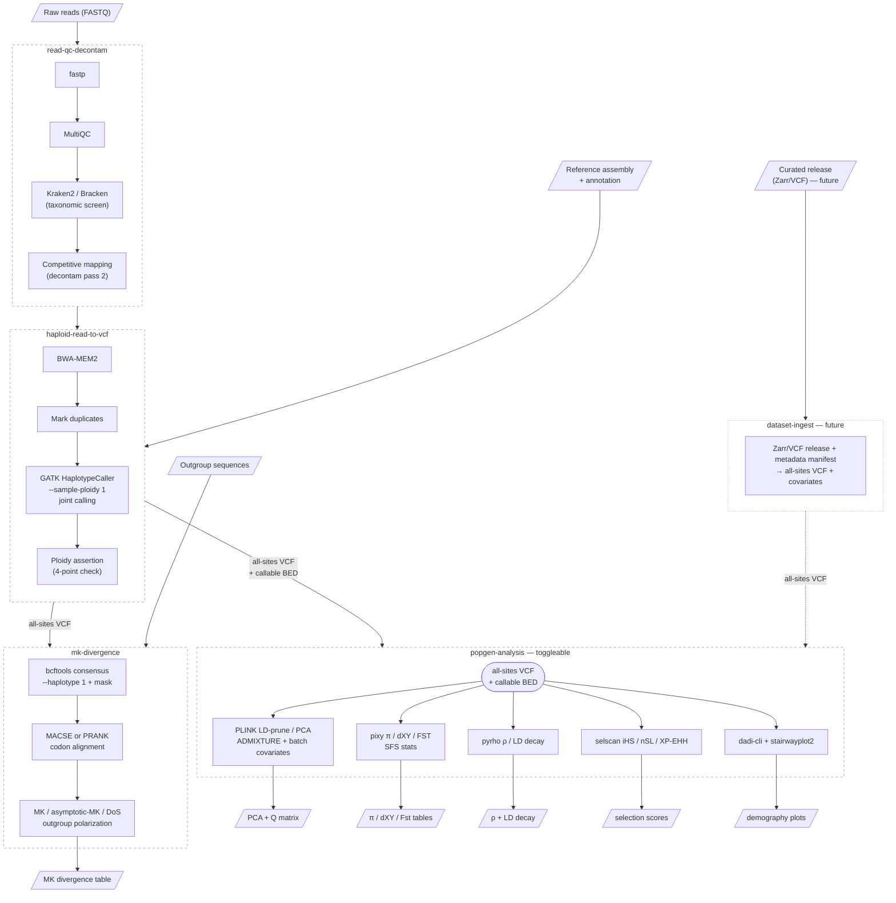

# PLAIG (Pathogen Lineage Analysis & Inference of Genotypes) — Galaxy Read-Level Population Genomics Design

*Companion to `comparative-genomics-program.md` (§4.2, §5, §7, §8). Design doc for the Galaxy workflow suite generalizing crypto protocol Modules 1–2. Style follows the ANCOR design docs: workflows, subworkflows, tool availability, principles.*

Status: design stage, 2026-07-30

## What it is

A Galaxy workflow suite for **read-level population and divergence genomics of haploid-dominant eukaryotic pathogens**: reads → haploid all-sites VCF → population analysis (structure, diversity, recombination, selection scans, demography) → MK divergence. Derived from the crypto protocol's Module 1 (§5–6, within-species) and Module 2 (§7, polymorphism–divergence), generalized from a single-organism study design into a reusable, organism-configurable suite. The **most-demanded** program component (program doc §7.5): drug-resistance surveillance, transmission/outbreak tracking, vaccine escape — and currently the worst Galaxy tooling story (§8 gaps).

## Scope

- **In scope (config-level port, no code changes)**: organisms with a **haploid-dominant life stage** — Cryptosporidium (reference instance), Plasmodium, Toxoplasma, Babesia, Theileria, Trypanosoma, haploid fungi (Cryptococcus, Aspergillus). Minimum target: all apicomplexans.
- **Edge case — Leishmania**: haploid calling standard, but aneuploidy is first-class biology; promote the depth/CNV module from provisional to primary.
- **Out of scope for v1**: diploid/polyploid pathogens, bacteria (mature ecosystem: snippy/roary), Giardia (ploidy weirdness). See §"Beyond haploid" below for what a diploid extension would require.
- **Boundary principle**: the architecture is organism-agnostic; the real boundaries are **ploidy and reproductive mode, not taxonomy** (program doc §7).

## Design principles

1. **Generic subworkflows + thin organism-specific parent.** All reusable logic lives in generic subworkflows parameterized by workflow parameters; organism specifics (tier gating, typing loci, named outgroups) are parameters/optional steps in a thin parent — same pattern as pangenome-helpers.
2. **All-sites discipline is non-negotiable.** Variants-only VCFs make π/dXY uncomputable or computed against an unknown denominator (crypto §5.6, Appendix B). Diversity/divergence tracks require joint-called all-sites VCFs + callable BED; the callable genome is defined per sample and masked everywhere downstream.
3. **Ploidy is asserted, not assumed.** Protocol's four-point assertion (crypto §4.5): ploidy argument = 1, job log = 1, no diploid separators in GT fields, ploidy-file = 1 — checked before and after every calling job. Failure fails the job.
4. **Contamination handling in two passes.** Pass 1: taxonomic screen (Kraken2/Bracken). Pass 2: competitive mapping against a per-organism decontamination panel (mixed-species infection called as within-species polymorphism is a named failure mode, crypto §5.3/Appendix B).
5. **Mixed infection is first-class.** F_WS-style within-host multiplicity filtering to a dominant-genotype subset for population analyses; dedicated mixed-infection analyses kept separate (crypto §5.9, §6.9). Candidate validation harness: PlasmoGenEpi `recombuddy` simulations (program doc §7.4).
6. **Batch/geography confounding is checked, not hoped away.** Batch covariates in every structure analysis (crypto Appendix B).
7. **Library-prep provenance gates eligibility.** Tier system (WGA/capture/direct) with per-analysis eligibility rules (crypto §2.4) — assembly-free analyses are not immune to prep artifacts. Per-organism parents define tiers; eligibility stays config.
8. **Documented tool divergence.** Where the suite uses different tools than other suites (or offers two callers), the choice is justified in one place (program doc §9).
9. **Credited borrowing.** Reference manifest semantics and NCBI-query reference fetching borrowed from nf-core/`pathogensurveillance`; optional PMO export inspired by PlasmoGenEpi (program doc §7.4).

## Workflow decomposition

Generic subworkflows (no organism-specific parent needed — all organism specifics are workflow parameters):

| Subworkflow | Contents | Crypto section | Tool gaps |
|---|---|---|---|
| `read-qc-decontam` | fastp, MultiQC, Kraken2/Bracken pass 1 + competitive-mapping pass 2 | §5.1–5.3 | none — reuse IWC `short-read-qc-trimming` + `quality-and-contamination-control-raw-reads`; add pass 2 as optional extension |
| `haploid-read-to-vcf` | BWA-MEM2 → markdup → GATK `--sample-ploidy 1` joint calling → variants-only + **all-sites** VCFs + callable BED + masks; ploidy assertion built in | §5.4–5.8 | none — all tools IUC-wrapped |
| `popgen-analysis` | All population-level analyses from the all-sites VCF, as toggleable steps: **structure** (PLINK LD-prune/PCA, ADMIXTURE; batch covariates), **diversity** (pixy π/dXY/FST, SFS stats), **recombination** (pyrho ρ/LD decay — estimated before sweep scans, Appendix B), **selection scans** (selscan iHS/nSL/XP-EHH), **demography** (dadi-cli, stairwayplot2). User/parent selects which analyses to run. | §6.1–6.7 | **pixy, pyrho, selscan, dadi-cli wrappers**; vet or re-wrap ADMIXTURE (dereeper, 2015-era) |
| `mk-divergence` | masked consensus (`bcftools consensus --haplotype 1`, callable-complement mask → N, never silent reference), MACSE **or** PRANK codon alignment, MK/asymptotic-MK/DoS, outgroup polarization | §7.1–7.5 | **MACSE or PRANK wrapper** + custom scripts |

### Workflow diagram

### Why not existing IWC workflows (for IWC review)

IWC `variant-calling/haploid-variant-calling-wgs-pe` (fastp→BWA→Picard→LoFreq→snpEff) and `ploidy-aware-genotype-calling` (FreeBayes) are both **variants-only, per-sample, no joint genotyping, no all-sites output**. LoFreq is additionally mistargeted (within-host low-frequency variants, not population-consensus genotypes). The all-sites joint-calling gap is exactly what justifies `haploid-read-to-vcf`.

### Optional surveillance export

PMO-compatible allele table (PlasmoGenEpi Portable Microhaplotype Object) for typing-plugin loci → plugs into plasmodiumdrugres-style prevalence reporting (program doc §7.4).

## Per-organism parameters (port = parameters, no code)

Workflow parameters that must be supplied per organism (only what can't be computed from the data):

| Parameter | Used by | Crypto instance |
|---|---|---|
| Reference assembly + annotation | all subworkflows | CpBGF + cgd IDs |
| Mappability/repeat/subtelomere masks | diversity, MK, scans | §5.7.1 |
| Decontamination panel (competitive mapping) | read-qc-decontam pass 2 | Cryptosporidium spp. panel |
| Outgroups | mk-divergence | §7.3: CmTU1867 (primary), C. ubiquitum (secondary), C. muris RN66 (deeper check); C. tyzzeri excluded |
| Ploidy | haploid-read-to-vcf | 1 |
| Tier definitions (library-prep eligibility) | popgen-analysis (gates which analyses run) | WGA/capture/direct (crypto §2.4) |
| Fws threshold (mixed-infection filtering) | popgen-analysis (structure step) | crypto §5.9 threshold |
| Typing plugin (optional) | popgen-analysis + PMO export | gp60 subtyping (crypto §6.8: targeted local assembly against repeat-collapsed reference) |

## Tool availability summary (program doc §8)

- **Available (IUC)**: fastp, MultiQC, Kraken2 (+DMs), Bracken, bwa_mem2, samtools/bcftools, GATK4, PLINK (1.9-era), mosdepth, seqkit, sra_tools; ADMIXTURE (dereeper — **vet or re-wrap**).
- **Needs wrappers (PLAIG owns)**: pixy, selscan, pyrho, MACSE or PRANK, dadi-cli (+ stairwayplot2, SweeD/OmegaPlus, fineSTRUCTURE parked as open questions).
- **Data fetching**: IWC `data-fetching/parallel-accession-download` + `sra-manifest-to-concatenated-fastqs` cover archive-sweep mechanics.

## Gaps surfaced by the MalariaGEN Pf8 proxy comparison (2026-08-05)

The Escalante-lab Pf8 proxy (FastAPI over the MalariaGEN Pf8 Zarr release: ~33k samples, gene/sample-filter slicing, 10 interactive pop-gen workflows) was reviewed against this design as a de-facto requirements document — its workflows are things malaria researchers actually run on a curated haploid release. Most of its Analysis tab maps cleanly onto `popgen-analysis` toggles (PCA→structure, Fst/diversity→pixy, iHS/XP-EHH→selscan), confirming the toggle list. The comparison also surfaced gaps, split into three buckets:

### A. Analyses the proxy has that `popgen-analysis` lacks (wrapper/scope decisions needed)

- **Fws as a first-class output, not just a filter.** The proxy's most-used view is Fws *by population*; here Fws appears only as a mixed-infection threshold parameter. Computing it needs an **moimix wrapper (R)** — not currently in the wrapper queue (§Tool availability).
- **H12 selection scan.** The proxy offers H12 alongside iHS/XP-EHH; selscan does not implement H12, which is the **unphased** option and therefore the robust one for Pf8-like unphased releases. Needs its own wrapper (Garud lab H12 script) or a documented decision to accept selscan-only.
- **VCF → NJ tree.** The proxy builds a neighbour-joining tree from a sliced VCF (anjl/scikit-allel) — the cheap-phylogeny niche between ADMIXTURE and IQ-TREE. Not in the plan; trivial to wrap (script + anjl, or IQ-TREE on a VCF-derived alignment).
- **Haplotype networks.** Median-joining networks (popart/pegas-style) per gene — present in the proxy, absent here and in the program doc. Include or explicitly scope out.
- **Allele frequency over space & time.** The proxy's freq-heatmap and freq-space-time workflows are surveillance-flavored; program doc §7.4 assigns that space to plasmodiumdrugres (Nextflow), but there is no Galaxy-side equivalent.

### B. The ingestion gap — curated release → all-sites VCF

The proxy and PLAIG start at opposite ends of the same pipeline: PLAIG assumes reads (`haploid-read-to-vcf`), the proxy assumes a curated release already exists (Pf8 Zarr). They meet at the all-sites VCF. The missing connective piece is a **dataset-ingest subworkflow: curated variant release (Zarr/VCF) + sample metadata manifest → all-sites VCF with covariates**, after which the entire `popgen-analysis` toggle stack runs on Pf8/Pv-style releases with no new methods. This is the single highest-leverage addition for the malaria community and fits the "parameterize, don't recode" principle (works for any MalariaGEN-style release).

Also noted: the proxy depends on **PLINK2**-specific behaviour (`--indep-pairwise`, PCA) throughout; the ToolShed audit lists "PLINK (1.9-era)". Verify the IUC PLINK2 wrapper covers what the structure step needs, or add PLINK2 wrapper work to the queue.

## Beyond haploid — what a diploid/polyploid extension would require

PLAIG v1 is haploid-only by design. Extending to diploid or polyploid organisms is not a parameter change — it requires new analytical paths for several workflows:

| Workflow | Haploid (current) | Diploid extension |
|---|---|---|
| Variant calling | GATK `--sample-ploidy 1` | GATK handles diploid natively; polyploid supported but less tested |
| Ploidy assertion | Four-point check: ploidy=1, no diploid separators, etc. | Becomes ploidy-aware rather than haploid-asserting; check against declared ploidy, not against 1 |
| Mixed-infection detection | Fws / dominant-genotype collapse — heterozygosity signals mixed infection | **Hard conceptual shift**: heterozygosity is normal diploid biology. Need allele-balance, read-backed phasing, or depth heuristics to distinguish true heterozygosity from mixed infection |
| Selection scans (selscan) | Trivially phased — one haplotype per sample | Requires **phasing pipeline** (whatshap for long reads, SHAPEIT/BEAGLE for short reads) — new subworkflow + new wrappers |
| Recombination (pyrho) | Estimates ρ from haploid haplotypes | Needs phased data; methodology may need adaptation |
| Demography (dadi-cli, stairwayplot2) | Works with haploid SFS | **Gets easier** — dadi is designed for diploid SFS |
| MK divergence | `bcftools consensus --haplotype 1` picks one haplotype | Need to phase and handle both haplotypes, or use a different consensus strategy |

**Bottom line**: variant calling and demography adapt easily. Selection scans and recombination need a phasing pipeline. Mixed-infection detection is the real blocker — the Fws framework assumes haploid, and there's no drop-in replacement for diploids. A diploid PLAIG would be a parallel analytical path, not a parameterized version of the haploid one.

## Open questions (program doc §10 + here)

- fineSTRUCTURE worth wrapping? (painful deps; ADMIXTURE+PCA+LD may suffice)
- SweeD/OmegaPlus as complement to selscan, or out?
- Depth/CNV module: provisional everywhere vs primary for aneuploid organisms (Leishmania) — one module with config severity, or two?
- pyrho vs LDhat: pyrho-primary adopted; keep LDhat wrapper on the queue or drop?
- Diploid extension: worth designing now, or revisit after haploid v1 is delivered?
- Fws output: add an moimix wrapper and promote Fws-by-population to a `popgen-analysis` product, or keep it filter-only? (Pf8 proxy comparison, bucket A)
- H12: wrapper for the unphased scan, or selscan-only with justification? (bucket A)
- NJ tree from VCF (anjl/scikit-allel) and haplotype networks: add to `popgen-analysis` toggles or out of scope? (bucket A)
- Curated-release ingestion subworkflow (Zarr/VCF release + metadata manifest → all-sites VCF): PLAIG-owned, or shared infrastructure (program doc §4.2)? (bucket B)
- PLINK2 wrapper currency: does the IUC wrapper cover `--indep-pairwise`/PCA as used by the structure step?
- UCSC assembly hub output: PANTEON produces hubs (WF-K). Should PLAIG also emit a hub (e.g. variant tracks, selection-scan peaks, callable-regions BED) for visualization on the BRC site?

## Sources

- Crypto protocol v2.1c: §2.4, §3.2, §3.5, §4.5, §5, §6, §7, Appendix B
- Program doc §4.2 (shared subworkflows + near-misses), §5 (decomposition), §7 (generalization), §8 (ToolShed audit)
- IWC near-miss workflows verified: `variant-calling/haploid-variant-calling-wgs-pe`, `variant-calling/ploidy-aware-genotype-calling`, `genome-assembly/quality-and-contamination-control-raw-reads`, `read-preprocessing/short-read-qc-trimming`
- MalariaGEN Plasmodium proxies (Escalante lab, [github.com/asgiraldoc/MalariaGEN-Pf8-Data-Retrieval-Proxy](https://github.com/asgiraldoc/MalariaGEN-Pf8-Data-Retrieval-Proxy)): workflow inventory reviewed 2026-08-05 — PCoA, Fws, NJT, PLINK2 PCA, freq heatmap, Fst, diversity/Tajima's D, selection scan (H12/iHS/XP-EHH), haplotype network, freq over space & time. Deployed as 6 per-species instances (Pf8, Pv5, Pk1, Pmb1, Poc1, Pow1)
